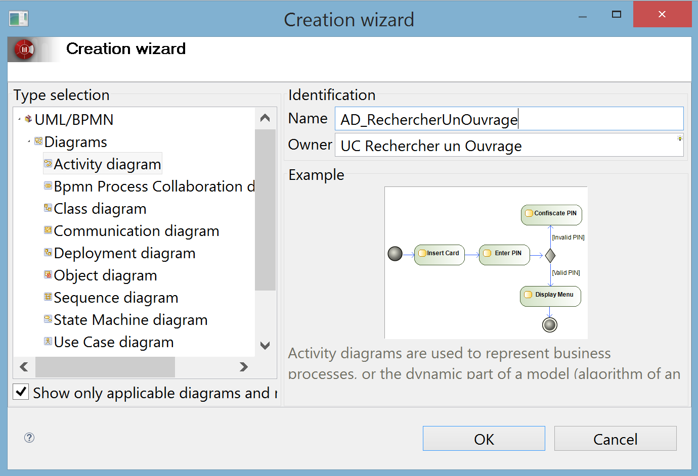
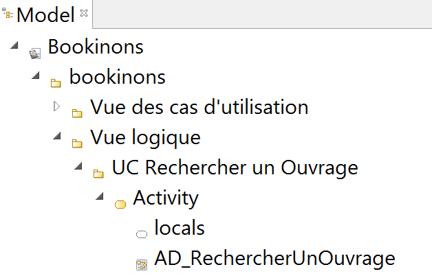
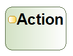
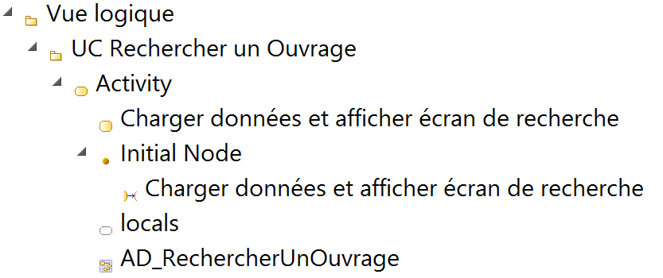
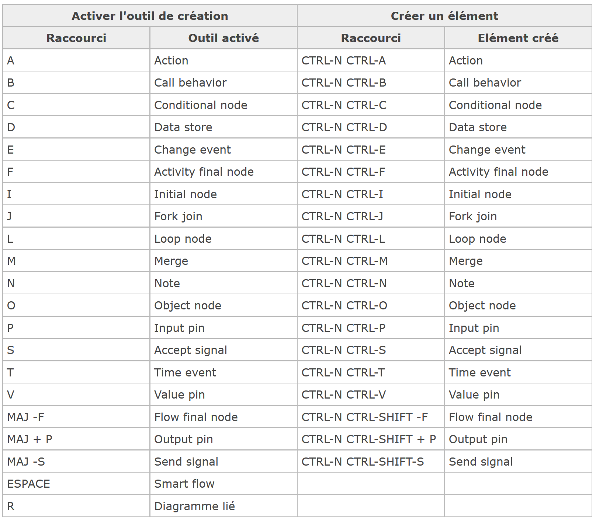
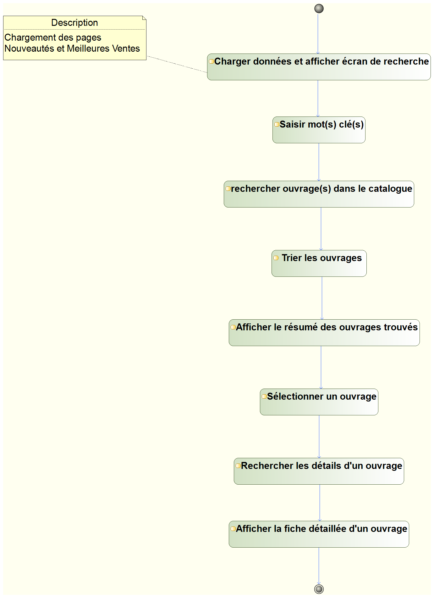
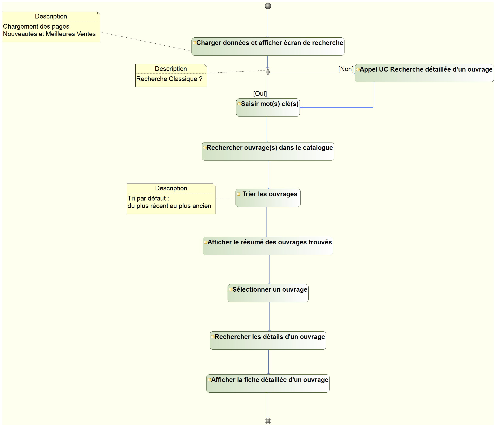
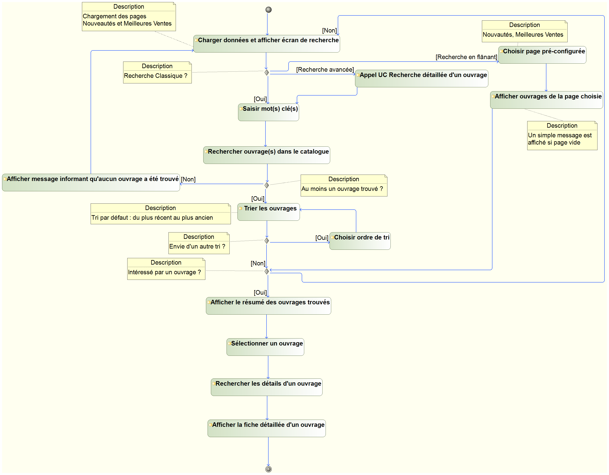
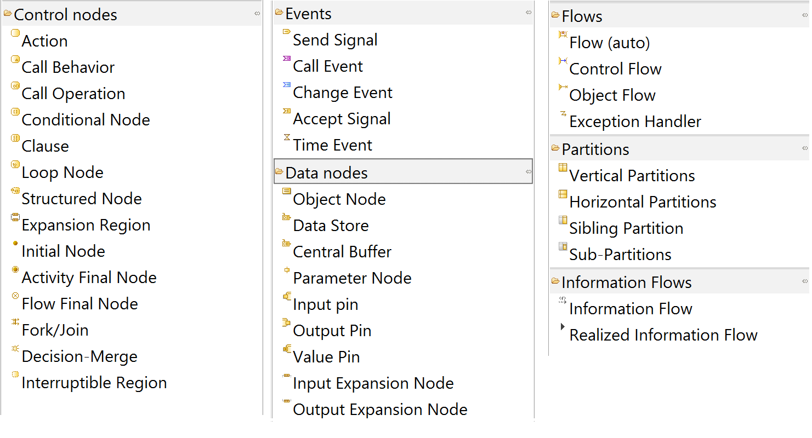

# Prise en main de Modélio : Diagrammes d'activités


[Les diagrammes d’activités modélisent les procédures ou les workflows.](https://forge.modelio.org/projects/modelio-user-manual-french-22/wiki/Modeler-_modeler_diagrams_creating_diagram)

Nous considérons qu'arrivé(e) à ce point du tutoriel, vous avez réalisé la partie précédente relative à la prise en main des [diagrammes de cas d'utilisation](Modelio_UseCase.md) et que vous savez désormais comment redimensionner un élément, le renommer, changer son apparence, le supprimer, l'annoter,...

Dans ce tutoriel, nous nous verrons comment :

* [Créer un diagramme d'activités](#creerDiagrammeActivites)
* [Créer un état initial](#creerEtatInitial)
* [Créer une action](#creerAction)
* [Créer une transition](#creerTransition)
* [Créer un état final](#creerEtatFinal)
* [Créer une décision](#creerDecision)
* [Connaître les raccourcis autour du diagramme d'activités](#raccourcisDiagrammeActivites)


Nous nous appuyerons dans ce tutoriel sur le cas d'utilisation **`Rechercher un ouvrage`** dont nous modéliserons les différents scénarios :  

* [scénario nomimal du UC Rechercher un ouvrage](#ScenarioNonimal_UCRechercherUnOuvrage)  
* et [scénario alternatif du UC Rechercher un ouvrage](#ScenarioAlternatif_UCRechercherUnOuvrage)


Vous aurez quelques exercices à réaliser tout au long du tutoriel :

* [Commencer par le scénario de base du UC Rechercher un Ouvrage](#aVosCrayons_Exo1)
* [Représenter l'ensemble des scénarios du UC Rechercher un Ouvrage](#aVosCrayons_Exo2)


Nous finirons par :

* [Recenser les différents éléments spécifiques aux diagramme d'activités](#elements_DiagActivites)
* [Des exemples de diagrammes d'activités réalisables avec Modelio](#exemples_DiagActivites)
* [Quelques mots sur les diagramme d'activités dans la démarche d'analyse du cours](#analyseUML_DiagActivités)


N'oubliez pas que vous pouvez, à tout moment, revenir consulter le [Zoom sur le manuel utilisateur](Modelio_UseCase.md#zoomManuelUtilisateurs) (récapitulatif de liens vers les différentes parties du manuel utilisateur utiles pour la création des diagrammes).


## Créer un diagramme d'activités <a id="creerDiagrammeActivites"></a>

Dans cette partie du tutoriel, nous allons réalisé le diagramme d'activités décrivant le cas d'utilisation **`Rechercher un ouvrage`**

Dans le package **`Vue logique`** de la vue **Model**, commencez par créer un nouvau package que vous nommerez **`UC Rechercher un Ouvrage`**.

La création d'un diagramme d'activité (comme tout autre diagramme) se fait de la même manière que la [création d'un diagramme de cas d'utilisation](Modelio_UseCase.md#creerDiagrammeUC).  

Par exemple à partir de la **vue Modèle**, un clic droit sur le  package **`UC Rechercher un Ouvrage`** permet d'ouvrir un menu contextuel et de choisir **`Créer un diagramme ou une matrice…` du menu contextuel.  
Sélectionnez le type de diagramme **`Activity diagram`**
Renommez-le, par exemple en **`AD_RechercherUnOuvrage `**.  
Vérifiez que le propriétaire du diagramme est bien **UC Rechercher un Ouvrage** c-a-d l'élément sélectionné au départ.
Cliquez sur **OK** pour valider la création du diagramme.


La **vue Modèle** est alors mise à jour avec le nom de notre nouveau diagramme : **`AD_RechercherUnOuvrage`** dans la vue logique en dessous du package **`UC Rechercher un Ouvrage`**.  



**N'oubliez pas de sauvegarder régulièrement votre projet au cours de ce tutoriel...**


## Présentation du scénario nomimal du UC Rechercher un ouvrage <a id="ScenarioNonimal_UCRechercherUnOuvrage"></a>

Nous souhaitons commencer par modéliser le scénario nominal du **`UC Rechercher un ouvrage`** qui correspondrait à la description textuelle suivante :

    Le Système recherche les informations relatives à la recherche (Nouveautés, Meilleures ventes,...) et affiche l’écran de recherche.
    
    L’Internaute saisit un ou plusieurs mots-clés (un thème, un titre, un auteur, un nom d'auteur)  et valide.  
    
    Le Système recherche dans le catalogue les ouvrages pouvant correspondre à la demande de l'utilisateur.  
    
    Le Système trie les ouvrages dans l'ordre souhaité.  
    
    Le Système affiche dans une page de résultat un résumé des ouvrages trouvés.  
    
    L’Internaute sélectionne un ouvrage.  
    
    Le Système recherche le détail de l'ouvrage.  
    
    Le Système affiche une fiche détaillée de l'ouvrage qui contient :  
    	* une image de l ’ouvrage, le titre, l'auteur  
    	* l'éditeur, l'isbn, la langue, la date de parution  
    	* le prix et la disponibilité  


Un scénario nominal commence toujours par ***un état initial*** ...

## Créer un état initial <a id="creerEtatInitial"></a>


  
Un **état initial** (**`Initial Node`**) est un ***élément de type *noeud***.    
Dans Modelio, l'élément **`Initial Node`** est associé au groupe **`Control Nodes`** de la palette graphique. 

Pour ajouter un nouvel **état initial** sur votre **diagramme d'activités**, commencez par ouvrir le groupe **Control Nodes** de la palette graphique.  
Cliquez ensuite sur **Initial Node**.
Rendez-vous ensuite sur le fond du diagramme (quadrillage jaune qui va contenir le diagramme),
un **clic gauche** permet de faire apparaître à l'endroit, où vous venez de cliquer, un **état initial** sur ce diagramme:  

Consultez également la **vue Modèle**  pour constater que l'état initial **Initial Node** a bien été ajouté.

Si vous le souhaitez, vous pouvez renommer votre élément (**`F2`**). Ce nom sera seulement pris en compte dans la vue Modèle et n'apparaît pas sur le diagramme.
Vous pouvez également le [redimensionner](http://forge.modelio.org/projects/modelio3-localization-usermanual-french-340/wiki/Modeler-_modeler_diagrams_changing_element_size) à votre convenance.

**Rappel :**
Le manuel utilisateur indique qu'il existe trois façons de créer un élément dans un diagramme sous Modélio :  

* soit en utilisant la commande **`Créer un élément`** du menu contextuel.
* soit en utilisant les **icônes de la palette** des diagrammes.
* soit en utilisant le **glisser-déposer depuis l'explorateur** vers les diagrammes.

Ces différentes possibilités en jetant un petit coup d'oeil à la rubrique **Créer un élément** disponible : [ici](https://forge.modelio.org/projects/modelio3-localization-usermanual-french-340/wiki/Modeler-_modeler_building_models_creating_elements) 


## Créer une action <a id="creerAction"></a>


  
Une **action** (**`Action`**) est un ***élément de type *noeud***.    
Dans Modelio, l'élément **`Action`** est associé au groupe **`Control Nodes`** de la palette graphique. 

#### Nouvelle action
Pour ajouter une nouvelle **action**, sélectionnez **`Action`** du groupe **`Control Nodes`** de la palette graphique, puis cliquez sur sur votre **diagramme d'activités** à l'endroit souhaité pour faire apparaître l'action.

Consultez également la **vue Modèle**  pour constater que l' **Action** a bien été ajouté.

***Conseil:** Pour redimensionner automatiquement la taille de votre action, n'hésitez pas à utiliser l'icône  (accessible dans la barre d'outils de la **vue d'Edition des diagrammes**, à côté des icônes correspondant aux différents choix d'alignement).*


#### Nommer, annoter et redimensionner une action
Un scénario est une séquence d'actions. Une action est une unité de traitement très petite qui a une incidence sur le système (modification de l’état, récupération d’une information ...)
Les actions sont des étapes autour desquelles on détermine des comportements.  

La première action du scénario nominal correspond à la première ligne :  
  
``` 
Le système recherche les informatives relatives à la recherche (Nouveautés, Meilleures ventes,...) et affiche l’écran de recherche
``` 

Dans le diagramme d'activités, cette activité peut être **nommée** par exemple :
**`Charger données et afficher écran de recherche`**  
Consultez la **vue Modèle**  pour constater que le nom de l'**Action** a bien été modifiée.

Pour plus explicite cette activité, on peut choisir d'y ajouter la note suivante :
**`Chargement des pages Nouveautés et Meilleures Ventes`**, afin d'obtenir la configuration ci-dessous.  
*Rappels :   
 * L'élément **`Note`** est disponible dans le groupe **Common** de la palette graphique.  
 * Pensez à utiliser l'icône  pour redimensionner rapidement les éléments à la bonne taille !* 


## Créer une transition <a id="creerTransition"></a>


  
Une **transition** (**`Flow`**) est un ***élément de type *lien***.    
Dans Modelio, l'élément **`Flow`** est associé au groupe **`Flows`** de la palette graphique. 

#### Nouvelle transition
Il faut maintenant relier par une transition l'état initial à l'action.
Cliquez sur **`Flow (auto)`** dans le groupe **`Flows`** de la palette graphique. 
Cliquez sur l'**Initial Node**, le point d'origine de votre lien (qui devient vert s'il est *cliquable*)
Cliquez sur l'**Action**, le point de destination de votre lien (qui devient vert s'il est *cliquable*)
Une transition sous forme de **flèche** est alors dessinée.  
Cette transition est *automatique* dès que l'état initial est fini : elle n'a donc pas besoin de déclencheur, par défaut c'est donc un **Control Flow**.

Consultez le **package Vue logique** dans la vue Modèle.  
Vous constatez que dans cette vue, l**`Initial Node`** (point de départ de la transition) possède désormais une arborescence avec la transition que nous venons d'ajouter sur le diagramme. Cette dernière est alors représentée par une icône de de type **Control Flow** associée au nom de l'action **`Charger données et afficher écran de recherche`** (point destination de la transition).



#### Paramétrer la transition
Les vues **Element** et **Symbol** permettent de paramatrer un élément.

Nous allons pouvoir modifier l'apparence de la transition en jouant sur les propriétés graphiques disponibles de la vue **Element**.

Double-cliquez sur la **transition** et rendez-vous dans sa vue **Element**.
La propriété **`line width`** de **Control Flow** permet par exemple de jouer sur l'épaisseur du trait de la transition. Par exemple avec une valeur **`3`**, la transition apparaît mieux sur le diagramme...


**Remarque:** Vous pouvez modifier l'apparence des élément de manière ponctuelle, comme nous venons de le faire.  
Avec Modelio, il est également possible ***créer vos propres styles pour vos diagrammes***. La rubrique **[Définir les options graphiques dans les diagrammes](http://forge.modelio.org/projects/modelio3-localization-usermanual-french-340/wiki/Modeler-_modeler_diagrams_graphic_options)** décrit les différentes étapes pour cela.
N'hésitez pas à la consulter, si vous êtes intéressés nous ne procéderons pas à la redéfinition de styles pour les diagrammes dans ce tutoriel.


## Créer un état final <a id="creerEtatFinal"></a>


  
Un **état final** (**`Activity Final Node`**) est un ***élément de type *noeud***.    
Dans Modelio, l'élément **`Activity Final Node`** est associé au groupe **`Control Nodes`** de la palette graphique. 

Pour ajouter un nouvel **état final** sur votre **diagramme d'activités**, commencez par sélectionner **`Activity Final Node`** dans le groupe **`Control Nodes`** de la palette graphique. 
Cliquez ensuite sur le diagramme à l'endroit où vous souhaitez faire apparaître le noeud.


**Remarques : **  

 * Un scénario nominal se terminera toujours par un état final
 * Un diagramme d'activité modélisant l'ensemble des scénarios d'un cas d'utilisation :
 	-	aura en général **un seul état initial** qui sera le point de départ du diagramme
	-	pourra avoir **un ou plusieurs état(s) final (finaux)**

## Connaître les raccourcis autour du diagramme d'activités  <a id="raccourcisDiagrammeActivites"></a>

Il existe des raccourcis pour créer plus facilement les diagrammes.  
Ceux correspondant aux éléments que nous venons de créer sont :

* **`I`** pour la création d'un **I**nital Node
* **`A`** pour la création d'une **A**ction
* **`ESPACE`** pour la création d'une transition (flow)
* **`F`** pour la création d'un Activity **F**inal Node


Le manuel utilisateur propose un tableau récapitulant les [raccourcis de création dans les diagrammes d'activités](http://forge.modelio.org/projects/modelio3-localization-usermanual-french-340/wiki/Modeler-_modeler_shortcuts_activity_diagram)



## Exercice : Commencer par le scénario nominal du UC Rechercher un Ouvrage <a id="aVosCrayons_Exo1"></a>

Afin de mettre en pratique tout ce qui prècède, modéliser le diagramme d'activités correspondant au scénario nominal du UC Rechercher un Ouvrage énoncé précédemment dans la partie [Présentation du scénario nomimal du UC Rechercher un ouvrage](#ScenarioNonimal_UCRechercherUnOuvrage) de ce tutoriel.
Reprendre un par un les points du flot de base et transformer les en action.

**Remarque :**  Votre diagramme sera d'autant plus facilement lisible, qu'il sera bien présenté.  
Veillez à bien aligner vos activités et vos transitions : votre diagramme sera d'autant plus facilement lisible, qu'il sera bien présenté 


Vous devriez obtenir un diagramme conforme au diagramme ci-après :



Peu importe si vos noms d'actions ne sont pas les mêmes que celles du diagramme ci-dessus, ce qui est important c'est que vos actions soient assez explicites pour qu'un client non informaticien puisse lire et comprendre votre diagramme.
Veillez à ce que vos noms d'actions ne soient pas être trop longs pour permettre une meilleure lisibilité (vous avez bien sûr remarqué que l'on a rajouté une note sur la première action...)


## Présentation d'un scénario alternatif du UC Rechercher un ouvrage <a id="ScenarioAlternatif_UCRechercherUnOuvrage"></a>

Nous allons maintenant représenter sur le diagramme le premier flot alternatif de la description détaillée, à savoir :

Nous souhaitons maintenant modéliser sur le diagramme d'activités de l'**`UC Rechercher un ouvrage`**  le **scénario alternatif** suivant relatif à la **Recherche avancée d’un ouvrage**

    Le flot alternatif  démarre après l'affichage de l'écran de recherche
    
    L ’Internaute choisit d’effectuer une recherche avancée
    
    Appel au UC Effectuer une recherche détaillée
    
    Le flot de base reprend à la recherche des ouvrages dans le catalogue

Pour modéliser une alternative sur le diagramme d'activité, on va utiliser une **décision** qui va nous permettre de mettre en place un ***branchement conditionnel*** sur le flot nominal.

## Créer une décision <a id="creerDecision"></a>


  
Une **décision** (**`Decision-Merge`**) est un ***élément de type *noeud***.    
Dans Modelio, l'élément **`Decision-Merge`** est associé au groupe **`Control Nodes`** de la palette graphique. 

#### Nouvelle Décision
Pour ajouter une nouvelle **décision**, il suffit de sélectionner **`Decision-Merge`** dans le groupe **`Control Nodes`** de la palette graphique, puis de cliquer sur le diagramme à l'endroit souhaité.

#### Une première décision : Recherche simple ou Recherche avancée ?

La recherche avancée peut être effectuée :

 * une fois la page d'écran affichée (**`Charger données et afficher écran de recherche`**) 
 * et à la place de la recherche par mot clé (**`Saisir mot(s) clé(s)`**)

Dans un premier temps, la transition entre ces deux premières actions du diagramme doit donc être supprimée de notre diagramme d'activité, puisque cette transition ne sera plus automatique, mais conditionnelle c-a-d soumise à la décision que prendra l'utilisateur pour réaliser sa recherche.  

Pour **supprimer la transition**, sélectionnez la puis appuyez sur la touche **`SUPPR`**.  
**Positionnez ensuite une décision** entre ces deux même activités.
Créez une **nouvelle transition** de la première action vers la *décision*,  
puis une autre **nouvelle transition** de la *décision* vers la seconde action.  
Créez une **nouvelle action** **`Appel UC Recherche détaillée d'un ouvrage`** et ajouter une **nouvelle transition** entre la *décision* et cette nouvelle action diagramme, afin d'obtenir un bout de diagramme similaire à celui ci-après :


#### Expliciter une décision

Il est maintenant nécessaire de rajouter un peu de texte afin d'expliciter **quelles sont les conditions** qui vont permettre de la *bonne* ***décision*** vers la *bonne* ***transition***.

##### Annoter la décision
Pour savoir quelle décision doit-être prise à cet branchement, il est conseillé d'ajouter une **Note** à la condition qui contient la description de la décision. Dans notre cas, la description peut se résumer à la question suivante : **`Recherche Classique ?`**

##### Faire apparaître les conditions de garde
Il faut ensuite faire apparaître les **conditions de garde** sur les transitions pour savoir quelle transition devra être déclenchée lorsqu'on sera face à la décision.

Une condition de garde sera représentée sur le diagramme entre crochet : **`[garde]`**.
La **`garde`** s'apparente à une expression booléenne qui est évaluée uniquement lorsque l'événement déclencheur se produit.
La transition se déclenche uniquement si l'expression booléenne est vraie. 

Pour commencer nous allons ajouter une **condition de garde sur la transition vers `Saisir mot(s) clé(s)`**.    
Cliquer sur la transition entre la *décision* et l'action `Saisir mot(s) clé(s)`.  
Rendez-vous dans la **vue Element** et renseignez par **`Oui`** la propriété de la valeur **`Guard`**.  
La condition de garde **`[Oui]`** apparaît alors sur la transition concernée.
Cela signifie que, désormais, cette transition ne pourra être franchie que si la réponse à la décision à prendre pour la *Recherche Classique ?* est positive. 
On parle alors **transition guardée**(notion revue dans les diagrammes d'états-transitions)

Ajoutez maintenant une **`Guard`** de valeur **`[Non]`** à la transition qui mène à l'action du flot altenatif à savoir la recherche détaillée d'un ouvrage afin d'obtenir le diagramme suivant :


##### Terminer le scénario alternatif de la recherche avancée

Une fois la recherche avancée effectuée, *le système recherche dans le catalogue les ouvrages pouvant correspondre à la demande de l’utilisateur*, comme l'indiqué le [scénario alternatif énoncé précédemment](#ScenarioAlternatif_UCRechercherUnOuvrage).

L'action suivant l'action **`Appel UC Recherche détaillée d'un ouvrage`** est donc : **`Rechercher ouvrage(s) dans le catalogue`** 

Il suffit donc d'ajouter sur notre diagramme une nouvelle transition de manière à obtenir un diagramme d'activité similaire au diagramme ci-après qui montre comment le scénario alternatif *se branche* sur le scénario nominal :



## Exercice : Représenter l'ensemble des scénarios du UC Rechercher un Ouvrage <a id="aVosCrayons_Exo2"></a>

Enrichissez votre diagramme d'activités pour modéliser l'ensemble des scénarios du cas d'utilisation **`Rechercher un Ouvrage`**.  

Passez en revue chaque action du flot nominal et pour chacune d'elle, posez vous la question de savoir si une décision peut être prise au niveau de cette action.  
Si votre réponse est positive, mettez en place une décision et modélisez à l'aide de nouvelle(s) action(s) le(s) scénario(s) alternatif(s) correspondant(s).


Vous devriez obtenir un diagramme conforme au diagramme ci-après :



Pour une meilleure lisibilité, la valeur de **`3`** a été attribuée à la propriété **`line width`** des (**`Control Flow`**) dans la **vue Symbol** pour augmenter l'épaisseur du trait des transitions. 

** Remarque :**  
Le diagramme d'activité appliqué au cas d'autilisation permet de représenter graphiquement les enchaînements des activités au sein de ce cas d’utilisation. 
Ce modèle permet donc d'**identifier d'un seul coup d’oeil la famille de tous les scénarios du cas d’utilisation et d’envisager ainsi toutes les possibilités d’exécution offertes par ce cas d'utilisation.**

## Recenser les différents éléments spécifiques aux diagramme d'activités <a id="elements_DiagActivites"></a>

#### D'après les spécifications officielles d'UML 

**Rappel:** Tous les éléments des diagrammes UML sont définis et illustrés dans le [Normative Documents](http://www.omg.org/spec/UML/2.5/PDF/).  
La dernière version est celle d'**UML 2.5**. Elle est disponible [ici](http://www.omg.org/spec/UML/2.5/)

Les chapitres **15.Activites** et **16.Action** du [Normative Documents](http://www.omg.org/spec/UML/2.5/PDF/) traitent des différents éléments associés aux diagrammes d'activités.

#### Sous Modélio

Pour un diagramme d'activités, la palette graphique propose les éléments spécifiques suivants :



Ces éléments respectent la terminologie énoncée dans le [Normative Documents](http://www.omg.org/spec/UML/2.5/PDF/) (spécification d'UML). 


## Des exemples de diagrammes d'activités réalisables avec Modelio <a id="exemples_DiagActivités"></a>

La rubrique [ressources du site ModelioSoft](https://www.modeliosoft.com/en/resources/diagram-examples.html) propose des exemples de diagrammes réalisés avec Modélio.

Les exemples concernant les diagrammes d'activités sont disponibles  : [ici](https://www.modeliosoft.com/en/resources/diagram-examples/activity-diagrams.html)


## Quelques mots sur les diagramme d'activités dans la démarche d'analyse du cours <a id="analyseUML_DiagActivites"></a> 

Dans notre démarche d'analyse pseudo-RUP, **un diagramme d'activité sera réalisé pour chaque cas d'utilisation**.

**La vue logique est donc organisé en packages** afin de pouvoir regrouper dans chaque package tous les diagrammes communs au même UC (pour l'instant nous ne traitons que du cas du diagramme d'activités, mais nous verrons plus loin que, dans notre démarche, chaque UC sera en réalité décrit par au moins 3 diagrammes : 1 diagramme d'activité, 1 diagramme de séquence et 1 diagramme de classes participantes)


**Le diagramme d'activité sera réalisé après le diagrame des cas d'utilisation**, une fois les premiers cas d'utilisation identifiés.
Comme il est utilisé dans le but de décrire un cas d'utilisation, il devra être réalisé en même temps que la maquette et la description détaillée du cas d'utilisation. 

Rappelons que pour documenter des cas d’utilisation, la **description textuelle des scénarios** est indispensable, car elle permet de communiquer facilement avec les utilisateurs et de s'entendre sur la terminologie métier employé. En revanche, le texte permet difficilement de montrer comment les enchaînements se succèdent, ou à quel moment les acteurs secondaires sont sollicités. Il est donc recommandé de compléter la desciption textuelle par un ou plusieurs diagrammes dynamiques UML (diagramme d'activités pour l'instant, diagramme(s) de séquence à venir...)

Rappelons que le diagramme d'activité, de par son approche graphique, facilite grandement la visualisation des enchaînements des activités au sein d'un même cas d’utilisation. Il permet ainsi d'identifier en un seul coup d’oeil toute la famille des scénarios du cas d’utilisation et permet d’envisager toutes les possibilités d’exécution offertes par ce Use Case.

Il est donc intéressant de vérifier à tout moment, par une lecture simultanée, que les deux vues (description détaillée (*textuelle*) et diagramme d'activités (*grahique*)) sont bien cohérentes.

En construisant le diagramme d'activité, on va souvent être amené à constater qu'il manque des étapes dans la description détaillée, voire même de nouveaux cas d'utilisation. 
La description détaillée et le diagramme d'activités proposent donc deux vues différentes sur le même cas d'utilisation qui se veulement cohérentes, complémentaires et qui permettent de s'enrichir mutuellement et d'enrichier également le diagramme des cas d'utilisation.

### Continuez la tutoriel par la prise en main des [diagrammes de classes](Modelio_Classes.md) 

