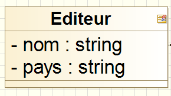
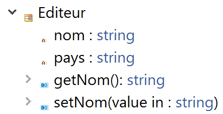
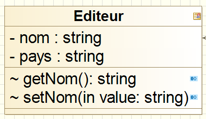
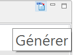
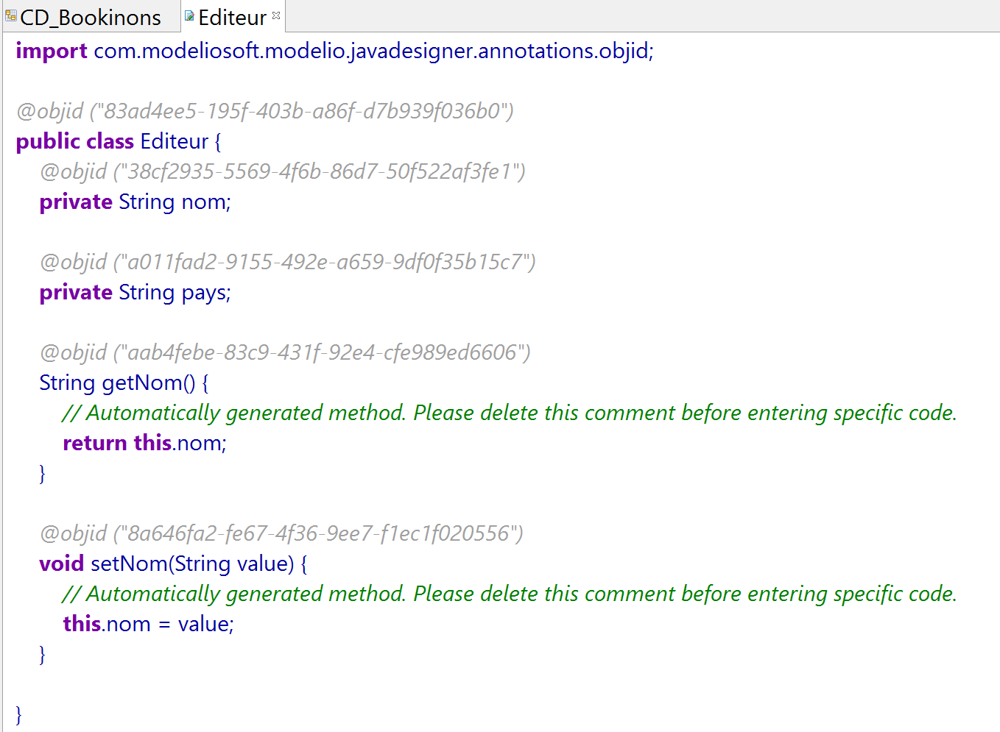
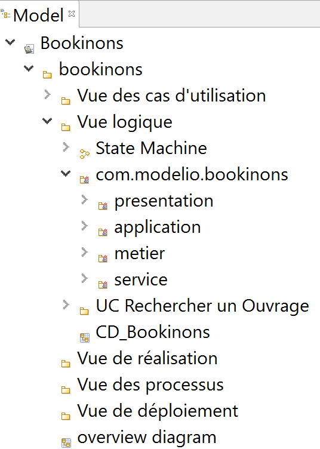
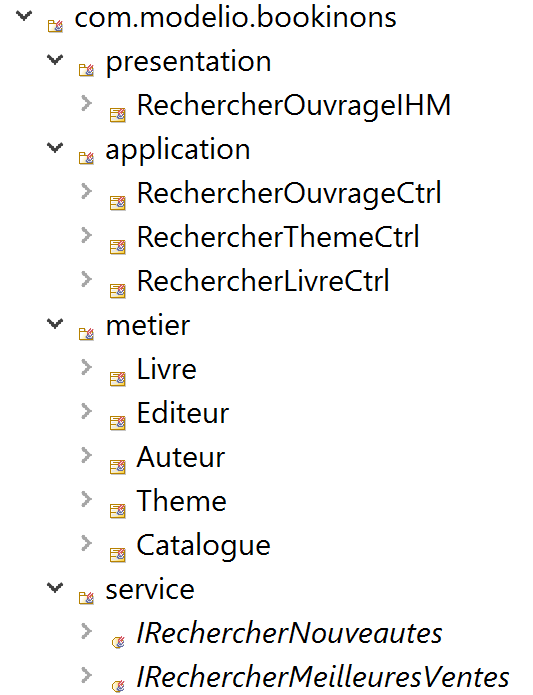

# Prise en main de Modélio : Génération de code Java
<!-- => retour à la ligne, 2 espaces .... -->

A partir entre autres des diagrammes de classes, les AGL peuvent produire directement du code source (squelettes des classes) dans les principaux langages objets (Java, C++, C#, ...). Modelio permet la production de code applicatif en fournissant des fonctions de *round-trip* assurant ainsi la synchronisation entre le code et le modèle.

Dans ce tutoriel, nous nous verrons comment :

* [Transformer une classe en **`Element Java`**](#transformerClasseEltJav)
* [Personnaliser la génération de code d'un attribut](#personnaliserAttributJava)
* [Générer le code Java](#genererCodeJava)
* [Editer le code Java dans Modelio](#editerCodeJava)

Vous aurez quelques exercices à réaliser tout au long du tutoriel :

* [Génerer le code Java des classes métiers](#aVosCrayons_Exo1)
* [Génerer le code du projet](#aVosCrayons_Exo2)

## Transformer une classe en **`Element Java`** 

Rendez-vous dans le diagramme de classes et sélectionnez une classe, par exemple la classe **`Editeur`**.  
Pour indiquer que cette classe fera l'objet d’une génération de code, rendez-vous dans l'onglet **`Java`** en bas de votre fenêtre de travail et cochez **`Element Java`**.

Une icône apparaît alors en haut à droite à côté de du nom de la classe pour signifier que cette classe est bien un **`Element Java`**.

## Personnaliser la génération de code d'un attribut 

Sélectionnez l'attribut **`nom`** de la classe **`Editeur`** et rendez-vous dans l'onglet **Java**.

Cochez, par exemple les propriétés **Getteur** et **Setteur** pour indiquer qu'à cet attribut devront correspondre des accesseurs en Java.  
Consultez alors la classe **`Editeur`** dans la **Vue Model**, vous constaterez que les méthodes
**`Editeur`** et **`Editeur`** ont bien été ajoutées à la classe **`Editeur`**.

Pour les faire apparaître sur le diagramme de classes, glissez-déposez les de la **Vue Model** vers la classe **`Editeur`**.

## Générer le code Java 

Pour lancer la génération de code, il suffit de cliquer sur l'îcone générer en bas à droite de votre espace de travail.

Une autre solution consiste à se placer dans la vue Model, puis d'un clic doit à ouvrir un menu contextuel afin de choisir (`Java Designer -> Generer`).

Pour vous assurez que le code a bien été généré, vous pouvez consulter votre répertoire**`workspaceModelio`** à l'aide d'un explorateur de fichiers. Vous constaterez qu'il existe désormais un répertoire **`src`** qui un fichier **`Editeur.java`**

## Editer le code Java dans Modelio 

Pour éditer le code Java généré directement sous Modelio, placez-vous dans la **Vue Model** sur la classe **`Editeur.java`**, puis d'un clic droit sélectionnez (`Java Designer -> Editer`).

## Exercice : Génerer le code Java des classes métiers 

Transformer toutes les classes metiers du diagramme de classes en **`Element Java`**. 
Placez-vous sur le package **Vue Logique** de la **Vue Model** et **Générer** le code Java correspondant.

Dans le fichier **`src`**, vous devez maintenant disposer des fichiers **`Auteur.java`**, **`Editeur.java`**, **`Catalogue.java`**, **`Livre.java`** et **`Theme.java`**.

Supprimez le contenu de ce fichier **`src`**.

## Transformer un package en **`Element Java`** 

Il est possible de transformer tout un package de classes en **`Element Java`**.  
Pour cela, rendez-vous dans l'arobrescence de la **Vue Model**, placez-vous par exemple sur le package **`presentation`**, puis rendez-vous sur la **Vue Java** et cochez **`Element Java`**.
L'icône se place alors directement sur le package (pas sur les classes du diagrammes de classes).  
Transformez également en **`Element Java`**, les packages **`application`**,**`metier`** et **`service`**.

Dans la vue logique, nous allons maintenant créer un nouveau package que nous appelerons :
**`com.modelio.bookinons`**.   
Transformez ce package en **`Element Java`**.  
Puis Transférez dans ce pakage les packages contenant les classes à savoir : **`presentation`**,**`application`**,**`metier`** et **`service`**.

Transformez ensuite ce pakage en **`Element Java`**. 
La génération de code portera alors sur l'ensemble de ce package.

## Exercice : Génerer le code du projet 

Transformez les classes des packages **`application`**,**`metier`** et **`service`** en **`Element Java`**.

Placez-vous sur le package **`com.modelio.bookinons`** de la **Vue Model** et **Générer** le code Java correspondant.

Consultez le fichier **`src`** et jetez un petit coup d'oeil sur les classes en éditant leur code source.

### Continuez la tutoriel par la [mise en place du roundtrip Modelio/Eclipse à partir de fichiers Java existants](Modelio_RoundtripEclipse.md) 

