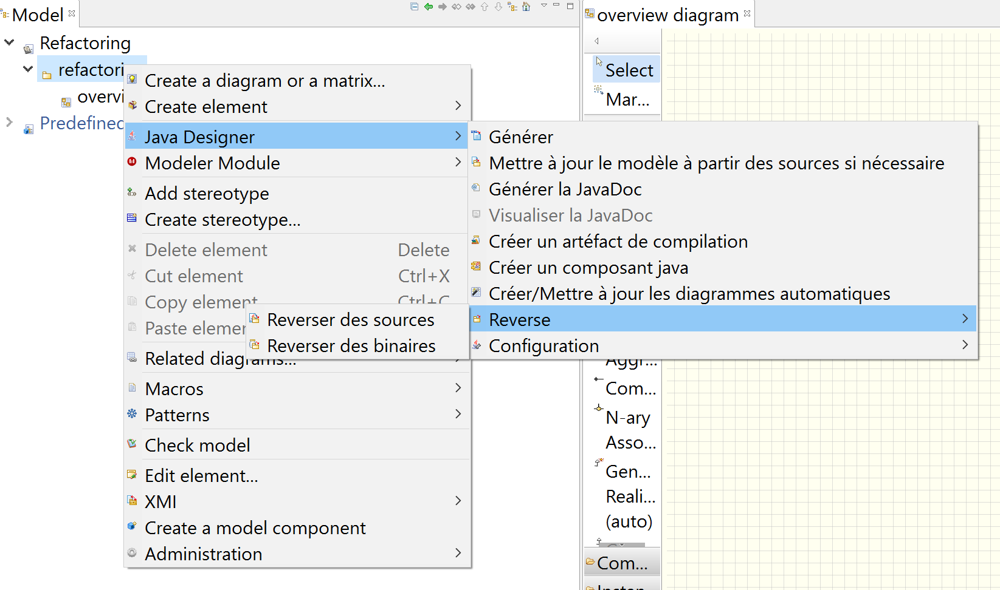
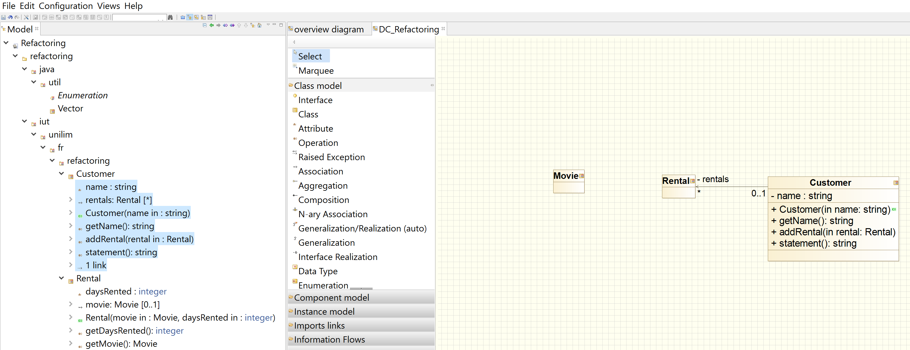
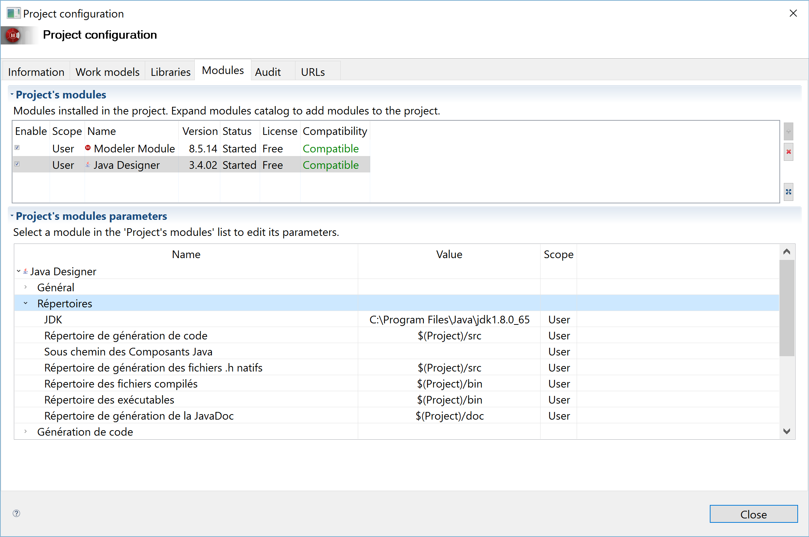
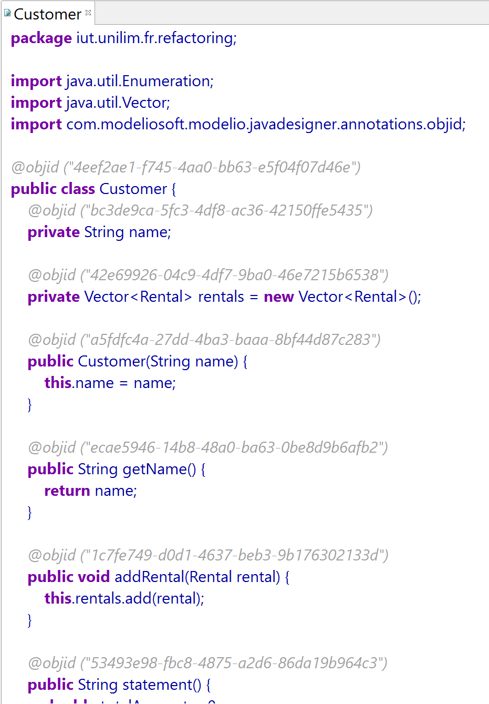

# Prise en main de Modélio : Mise en place du roundtrip Modelio/Eclipse à partir de fichiers Java existants 
<!-- => retour à la ligne, 2 espaces .... -->

[Wikipedia](https://en.wikipedia.org/wiki/Round-trip_engineering) propose la définition suivante :

> Round-trip engineering (RTE) is a functionality of software development tools that synchronizes two or more related software artifacts, such as, source code, models, configuration files, and even documentation.

Quant à la rubrique [Round-trip mode](http://forge.modelio.org/projects/javadesigner-modelio34-user-manual-english/wiki/Javadesigner-_javadeveloper_choose_functional_mode_round_trip_mode) du [Modelio Java Designer User Guide](http://forge.modelio.org/projects/javadesigner-modelio34-user-manual-english/wiki), elle introduit les principes du round-trip sous [Modelio](https://www.modelio.org/) comme suit :

> Round-trip engineering is a functioning mode that combines code generation and reverse engineering.   
> Code is generated in exactly the same way as with model driven engineering.  
> Specific annotations are also generated, **@objid**, which are used during the reverse engineering phase to match code and model elements in Modelio.  
> [...]   
> the round-trip mode allows the model to be directly modified at code level. The code is then fully reversed, in order to update the model.

Le round-trip va donc permettre que les modifications dans les modèles aient un impact direct sur le code et que les modifications sur le code aient un impact sur les modèles.

Dans ce tutoriel, nous verrons comment :

* [Ctéer une classe dans Modelio à partir d'un code source existant](#classeJavaToModelio)
* [Créer un diagramme de classes à partir des classes importées](#creerDiagClasses)
* [Editer le code généré par Modelio](#editerCode)
* [Modifier le code généré directement sous Modelio](#modifierCodeModelio)
* [Associer Eclipse à Modelio](#associerEclipseModelio)
* [Modifier le code sous Eclipse](#modifierCodeEclipse)
* [Générer la Javadoc sous Modelio](#genererJavadocModelio)
* [Générer automatiquement les diagrammes structurels et les diagrammes de dépendances](#genererDiagStructDepend)

Nous finirons par :

* [Quelques remarques](#remarques)
* [Quelques liens](#liens)

## Créer une classe dans Modelio à partir d'un code source existant 
Commencez par ouvrir **Modelio** et créer un nouveau projet (`File -> Create a project...`) que vous appelerez**`Refactoring`**. N'oubliez pas de cocher la case **Java Project**.

Placez-vous sur le package **`refactoring`**, puis d'un clic droit sélectionnez (`Java Designer -> Reverse -> Reverser des sources`)

Commencez par vérifier que la **Granularité** en bas de la fenêtre est bien à **Complet**.
En effet, Modelio propose 3 niveaux de granulité pour le reverse engineering (Structurel simple, Structurel complet et Complet). Pour plus de détails, vous pouvez consulter la rubrique [Three reverse levels](http://forge.modelio.org/projects/javadesigner-modelio34-user-manual-english/wiki/Javadesigner-_javadeveloper_java_reverse_three_reverse_levels) du [Modelio Java Designer User Guide](http://forge.modelio.org/projects/javadesigner-modelio34-user-manual-english/wiki) 
  
Vous devez maintenant chercher à importer les codes sources des classes [**`Customer.java`**](/src/Customer.java), [**`Movie.java`**](/src/Movie.java) et [**`Rental.java`**](/src/Rental.java) disponibles dans le répertoire de ce tutoriel [src](/src).  
Une fois l'adresse du répertoire saisie, sélectionnez les 3 classes, puis cliquez sur **`Suivant`** jusqu’à avoir la possibilité de cliquez sur **`Reverse`**.

L'arborescente suivante est alors créée dans la **vue Model**.  
Vous constatez que les classes **`Customer`**, **`Rental`** et **`Movie`** ont bien été créées en respectant une arborescence respectant l'instruction `package iut.unilim.fr.refactoring;` des fichiers `.java`.

## Créer un diagramme de classes à partir des classes importées 

Créez un nouveau diagramme de classes que vous appelerez par exemple **`DC_Refactoring`**. 

Faites glisser les classes de la **vue Model** vers le diagramme de classes.  

La classe apparaît dans un premier temps, mais sans attribut, ni opération.  
Pour faire apparaître les attributs, glissez-les de l'arborescence vers le diagramme comme le montre la figure ci-dessous pour la classe **`Customer`**.

Recommencez l'opération pour les classes **`Rental`** et **`Movie`**, de manière à obtenir un diagramme de classes similaire au suivant :

**Rappel:** Vous pouvez redimensionner automatiquement la taille de votre classe grâce à utiliser l'icône .

## Editer le code généré par Modelio 
Pour éditer le code d'une classe directement sous Modelio, il suffit normalement de se placer dans la **Vue Model** sur la classe, puis d'un clic droit sélectionner (`Java Designer -> Editer`).

Essayez de faire cette manipulation sur la classe **`Customer`**.  
Que se passe-t-il ? L'option `Editer` est effectivement bloquée.
  
Avant de pouvoir procéder à l'édition de la classe, il faut **générer** le code.
En effet, Modelio ne modifiera pas le code initial de vos fichiers sources, mais il génerera ses propres codes sources pourvus des annotations **`@objid`** qu'il stockera dans un répertoire **`src`** du projet sur lequel vous travaillez dans le workspace Modelio en cours. Cette information se retouve à partir du menu (`Configuration -> Modules`), puis en consultant les informations des `Repertoires` relatives au module `Java Designer`.

Placez-vous donc dans la vue **Model** sur le package **`refactoring`**, puis d'un clic droit, sélectionnez (**`Java Designer -> Generer`**).

Placez-vous maintenant dans la vue **Model** sur la classe **`Customer`** par exemple, puis d'un clic droit, sélectionnez (**`Java Designer -> Editer`**).

Vous obtenez alors un code similaire au suivant :

La rubrique [Updating the UML model](https://forge.modelio.org/projects/javadesigner-modelio3-user-manual-english/wiki/Javadesigner-_javadeveloper_java_reverse_updating_model) du [Modelio Java Designer User Guide](http://forge.modelio.org/projects/javadesigner-modelio34-user-manual-english/wiki) revient sur les annotations **`@objid`** qui ont été ajoutées par Modelio au code source java initial.

> This annotation contains the identifier of the modeling element that has been generated.
> 
> The “objid” annotation is used to find the modeling element in the Modelio project when it is reversed. Without it, the element is searched for by name. This makes it indispensable to update an element when it has been renamed or moved in the Java sources. For example, operations that have changed signature will be updated and not deleted, and then recreated.

Et sur l'ajout de l'**`import com.modeliosoft.modelio.javadesigner.annotations.objid;`** qui est nécessaire pouur pouvoir compiler le code ainsi annoté.
	
**Remarque:**  

* N'hésitez pas à éditer également le code des classes **`Movie`** et **`Rental`**    
* A l'aide d'un explorateur de fichiers, vous pouvez vous rendre dans le répertoire du workspace en cours et vérifier qu'il existe désormais un répertoire **`src`** sous **`refactoring`** contenant bien les trois classes de ce projet.

## Modifier le code généré directement sous Modelio 

Editer la classe **`Customer`**.

#### Ajouter un attribut depuis le code

Dans le code de la classe  **`Customer`**, ajoutez un nouvel attribut grâce à l'instruction suivante : **`private String nouvelAttribut;`**.  
Puis sauvegardez à l'aide d'un **`CTRL + S`**.

Rendez-vous ensuite dans le diagramme de classes pour constater que la classe **`Customer`** dispose bien de l'attribut **`nouvelAttribut`** : le modèle s'étant bien synchronisé avec le code lors de la sauvegarde du fichier.

... Mais le nouvel attribut de ne possède pas encore l'annotation **`@objid`**. Pour faire apparaître cette annotation, il est nécessaire de regénérer avec un (**`Java Designer -> Generer`**) par exemple depuis la vue **Model**.
Après la génération, le nouvel attribut possède alors une annotation **`@objid`** qui lui est propre.

#### Supprimer un attribut depuis le code

Dans le code de la classe  **`Customer`**, supprimez l'instruction suivante : **`private String nouvelAttribut;`**. Notez qu'il n'est pas possible de supprimer l'annotation `@objid`.

Sauvegardez, puis rendez-vous dans le diagramme de classes, le **`nouvelAttribut`** a bien disparu de la liste des attributs de la classe **`Customer`**...

... Mais l'annotation **`@objid`** est toujours présente dans le fichier du code source.  
Pour la faire disparaître, il suffit de regénérer la classe **`Customer`**.

#### Ajouter puis supprimer un attribut depuis modèle

Rendez-vous dans la vue **Model** sur la classe  **`Customer`** et ajoutez un **`nouvelAttribut`** de type String à l'aide d'un clic droit puis (**`Create element -> Attribute`**) et éventuellement de la vue **Element**.

Sauvegardez à l'aide d'un **`CTRL + S`**.  
Que se passes-t-il dans le code ? ... Rien ...

Pour voir apparaître ce nouveau attribut dans le code, il faut regnérer la classe **`Customer`**.

Supprimez ensuite le **`nouvelAttribut`** du modèle.
Il faut bien sûr regénerer pour voir le code impacté par cette modification.

### A retenir : Si vous souhaitez que le code et le modèle reste bien synchronisé, pensez à *Génerer* les modifications !  

## Associer Eclipse à Modelio 

Ouvrez Eclipse.

Comme Modelio stocke ses codes sources annotés dans un répertoire **`src`** du projet sur lequel vous travaillez dans le workspace Modelio, il est nécessaire de faire du workspace Modelio, le nouveau workpsace d'Eclipse.

Sous Eclipse, choisissez (`File -> Switch Workspace -> Other...`) et grâce au Browser déplacez-vous sur le répertoire du workspace modelio (que vous avez surement appelé **`workspaceModelio`**).

Sous Eclipse, créez un nouveau projet (`Java Project`) dont le nom est identique au projet sous Modelio c-a-d **`Refactoring`** dans notre cas.

Comme indiqué dans la rubrique [Updating the UML model](https://forge.modelio.org/projects/javadesigner-modelio3-user-manual-english/wiki/Javadesigner-_javadeveloper_java_reverse_updating_model) du [Modelio Java Designer User Guide](http://forge.modelio.org/projects/javadesigner-modelio34-user-manual-english/wiki) il se pourrait qu'Eclipse ne reconnaisse pas les annotations **`@objid`** spécifiques à Modelio.  
Si c'est le cas, vous devez ajouter au `Build Path` (clic droit `Build Path -> Add External Archives...`) le fichier **`javadesigner.jar`** qui contient la déclaration des annotations. 
Remarque : vous trouverez le fichier **`javadesigner.jar`** dans un répertoire **`bin`** de votre archive modelio (faites une recherche sur le nom du fichier pour connaître son chemin).

## Modifier le code sous Eclipse 

#### Modifications depuis Eclipse

Sous Eclipse, ouvrez la classe **`Customer`**, ajoutez un nouvel attribut : **`private String nouvelAttribut;`** et sauvegardez.

Rendez-vous ensuite sous Modelio, ouvrez le diagramme de classes.  
Sélectionnez la classe **`Customer`** dans la vue **Model**, puis à l'aide d'un clic droit (`Java Designer -> Mettre à jour le modèle à partir des sources si nécessaire`). La classe **`Customer`** sur le diagramme de classe est alors mise à jour avec le nouvel attribut, la classe **`Customer`** sous Eclipse reste inchangée.

Remarque : Par contre si vous sélectionnez (`Java Designer -> Générer`), la classe **`Customer`** sur le diagramme de classe sera mise à jour avec le nouvel attribut et la classe **`Customer`** sera mise à jour avec une annotation **`@objid`** sur le nouvel attribut.

#### Modifications depuis Modelio

Sous Modelio, placez-vous dans la vue **Model** et supprimez l'attribut **`nouvelAttribut`** de la classe **`Customer`**.  

Pour que la modification se répercute dans Eclipse, il faut bien sûr procéder à une nouvelle génération du code sous Modelio (`Java Designer -> Générer`).

## Générer la Javadoc sous Modelio 

Pour **générer la JavaDoc**, placez-vous sur le répertoire **`Refactoring`** dans la vue **Model**, puis d'un clic droit sélectionnez (**`Java Designer -> Générer la JavaDoc`**)

Pour **visualiser la JavaDoc**, sélectionnez ensuite (**`Java Designer -> Visualiser la JavaDoc`**)

**Remarque:** Dans une extension **payante** de Modelio, il possible que lors de sa génération, la Javadoc inclus des diagrammes structurels. générer la JavaDoc en y insérant des diagrammes structurel (la classe et ses associations avec les autres classes), ainsi que des diagrammes montrant les dépendances entre les différents packages (Une vidéo disponible [ici](http://www.modeliosoft.com/fr/ressources/tutoriels-video.html) vous en dira plus si vous êtes intéressés).

## Générer automatiquement les diagrammes structurels et les diagrammes de dépendances 

Placez-vous sur le répertoire **`Refactoring`** dans la vue **Model**.
Un clic droit (**`Java Designer -> Créer/Mettre à jour diagrammes automatiques`**) permet de générer automatiquement des diagrammes structurels et des diagrammes de dépendances pour le projet en cours...

## Quelques remarques 

Dans le manuel utilisateur de modélio se trouve une rubrique présentant un [plugin Modelio pour Maven](http://forge.modelio.org/projects/modelio3-localization-usermanual-french-340/wiki/Modeler-_modeler_maven_plugin)

J'aurais souhaité créer en reverse engineering le **diagramme de séquence** relatif à la méthode **`statement`** de la classe **`Customer`**, mais a priori Modelio ne permet le reverse que sur le diagramme de classes... Si vous connaissez une solution, n'oubliez pas la [pull request](https://help.github.com/articles/creating-a-pull-request/) ! 

## Quelques liens 
[Modelio Java Designer User Guide](http://forge.modelio.org/projects/javadesigner-modelio34-user-manual-english/wiki)

Les [**tutoriels vidéos**](http://archive.modeliosoft.com/fr/quick-tour-fr/modelio-video-tutorials.html) propose au travers de la rubrique ***11 – Développement Java piloté par le modèle avec Modelio*** un exemple de modélisation et génération de code sur un petit projet web. Les deux videos de cette rubrique sont disponible [ici](http://archive.modeliosoft.com/fr/quick-tour-fr/modelio-video-tutorials/109.html).

Vous pouvez également visionner la vidéo [Webinar - Demo - Java application design with Modelio](https://www.youtube.com/watch?v=eV4oAc4S__g).

 

