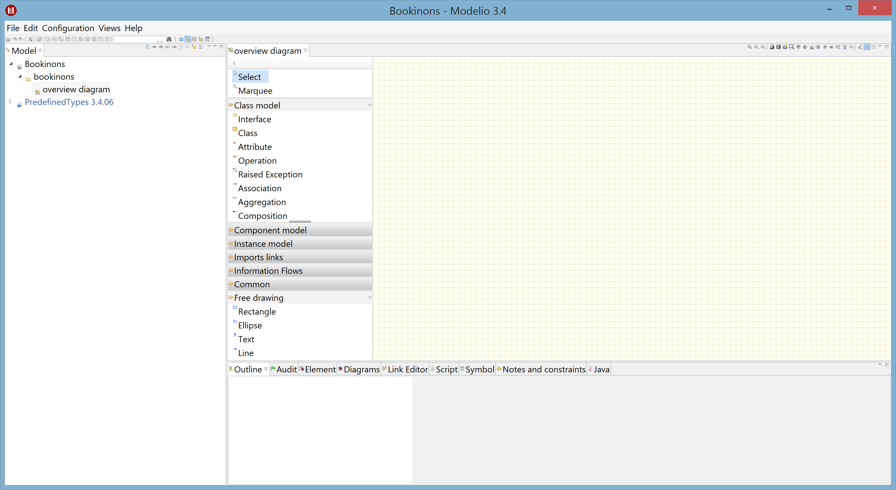

# Prise en main de Modélio : Introduction
<!-- => retour à la ligne, 2 espaces .... -->

 
*[UML](https://fr.wikipedia.org/wiki/UML_%28informatique%29) (Unified Modeling Language ou langage de modélisation unifié) est un langage de modélisation graphique à base de pictogrammes conçu pour fournir une méthode normalisée pour visualiser la conception d'un système. Il est couramment utilisé en développement logiciel et en conception orientée objet.* (Extrait [Wikipedia](https://fr.wikipedia.org/wiki/UML_%28informatique%29))  

Le site [uml.org](http://www.uml.org/) propose de nombreuses ressources autour d'UML dont 
les spécifications officielles qui sont disponibles à partir de [http://www.omg.org/spec/UML/](http://www.omg.org/spec/UML/)

De nombreux outils destinés à la modélisation graphique du langage UML existent. Une comparaison de ces différents logiciels est disponible à l'adresse suivante: [https://fr.wikipedia.org/wiki/Comparaison_des_logiciels_d'UML](https://fr.wikipedia.org/wiki/Comparaison_des_logiciels_d'UML)

Nous nous intéressons dans ce tutoriel à **Modelio**, un outil de modélisation UML open source dont le site de référence est :[https://www.modelio.org/](https://www.modelio.org/).

<!--Un aperçu de Modelio est disponible sur : [https://fr.wikipedia.org/wiki/Modelio](https://fr.wikipedia.org/wiki/Modelio)-->

[Modelio](https://www.modelio.org/) supporte la plupart des diagrammes spécifiés par UML 2.0.  
Il dispose également d'un système d'extensions sur le [Modelio Store](https://www.modeliosoft.com/modelio-store.html) qui permettent d'étendre ses fonctionnalités : des générateurs de code (Java, C++, C#) y sont par exemple disponibles. 

Dans ce tutoriel, nous nous intéressons plus particulièrement :

* aux [diagrammes de cas d'utilisation](Modelio_UseCase.md) (Use Case)
* aux [diagrammes d'activités](Modelio_Activites.md)
* aux [diagrammes de classes](Modelio_Classes.md)
* aux [diagrammes de séquences](Modelio_Sequences.md)
* aux [diagrammes d'états](Modelio_Etats.md)
* à la [génération de code Java](Modelio_GenerationCodeJava.md)

***Remarque:** Il est conseillé de suivre pas à pas les différentes étapes de ce tutoriel dans l'ordre ci-deddus. En effet, de nombreux détails seront donnés lors de la réalisation du premier diagramme (cas d'utilisation) et seront consiédérés comme acquis pour la suite des diagrammes.*

L'application à modéliser sera celle de l'étude de cas *bookinons*, inspirée du livre de Pascal Roques [UML 2 : Modéliser une application web](http://www.eyrolles.com/Informatique/Livre/uml-2-9782212123890).

## Sommaire
* [Installer Modelio](#installation)
* [Lancer Modelio](#lancement)
* [Choisir un workspace](#choixWorkspace)
* [A propos de la documentation dur Modelio](#documentation)  
* [Créer un projet](#creerProjet)
* [Découvrir la fenêtre de travail](#fenetreTravail)
* [Quelques liens utiles](#liens)

## Installer et lancer Modelio  

Rendez-vous sur le site [https://www.modelio.org/](https://www.modelio.org/).  
Dans le menu **Downloads**, sélectionner **Modelio** 
Téléchargez dans un répertoire **Modelio** la dernière version de Modelio correspondant à votre plate-forme via l'onglet **Latest release**.

Dézippez ce fichier. **Modelio** est prêt à être utilisé !

## Lancer Modelio  
Lancer Modelio via l'icône 

<!--[Icone Modelio"](images/modelio_logo.jpg)-->

Pour une première utilisation, fermez l'onglet **Welcome**.
Cet onglet pourra être ré-ouvert à tout moment depuis le menu (`Help -> Welcome`).

## Choisir un workspace  *

Le workspace est le répertoire de travail dans lequel seront stockés tous vos projets.  
Par défaut, Modelio utilise un workspace dans le dossier **`~/modelio`**

A partir de (`File -> Switch workspace`), vous allez pouvoir choisir ***le*** **workspace** dans lequel vous souhaitez que vos projets s'enregistrent. 

Dans le cadre de ce tutoriel, nous allons **créer un nouveau workspace**.
Déplacez-vous donc sur le répertoire dans lequel vous souhaitez créer un nouveau workspace.
A partir du bouton `Créer un dossier`, créer votre nouveau workspace que vous appellerez par exemple **`workspaceModelio`**.  
Sélectionnez ce nouveau dossier et cliquez sur OK pour qu'il deviennent votre nouveau workspace actif.

## A propos de la documentation sur Modelio 

Une version française du manuel utilisateur de Modelio est disponible sur la [Forge Modelio] (http://forge.modelio.org/) à l'adresse suivante :
[https://forge.modelio.org/projects/modelio3-localization-usermanual-french-340/wiki](https://forge.modelio.org/projects/modelio3-localization-usermanual-french-340/wiki).
Nous nous y référerons constamment au cours de ce tutoriel.

Ce manuel utilisatur est également accessible en ligne depuis le menu **Documentation** du site de [Modelio](https://www.modelio.org/), qui propose également un quick start guide, des tutotiels et une FAQ.

D'autres ressources sont également sur le site [https://www.modeliosoft.com/](https://www.modeliosoft.com/) (onglet **Ressources**).

N'oublions pas le site de la [Modelio Community Forge](http://forge.modelio.org/)

## Créer un projet  

Commencez par jeter un petit coup d'oeil [ici](http://forge.modelio.org/projects/modelio3-localization-usermanual-french-340/wiki/Modeler-_modeler_managing_projects_create_project) au manuel utilisateur de Modelio qui décrit le protocole créer un projet.

***Et maintenant à vous de jouer...*** 
Créez un projet que vous appelez `Bookinons`.  
Si vous le souhaitez, vous pouvez ajouter une **description** à ce projet comme par exemple `Ce projet permet de prendre en main l'outil Modelio`  
N'oubliez pas de cocher la case **Java** !

*Remarque* : Si avec un explorateur de fichiers, vous allez consulter le contenu du dossier **workspaceModelio**, vous remarquerez qu'il contient désormais un dossier **Bookinons**.

## Découvrir la fenêtre de travail  
Une fois le projet créé, une fenêtre de travail similaire à la figure ci-dessous se créée :

Le manuel utilisateur décrit en détail les différents outils et vues de cette fenêtre de travail. Consulter la page [Fenêtre de travail](http://forge.modelio.org/projects/modelio3-localization-usermanual-french-340/wiki/Modeler-_modeler_interface_main_window) pour en savoir plus sur les différents outils et différentes vues disponible dans cette fenêtre de travail et découvrir la légende ce la figure ci-dessous.
.

### Continuer le tutoriel par la prise en main des [diagrammes de cas d'utilisation](Modelio_UseCase.md) (Use Case)

## Quelques liens utiles UML et modelio 
[uml.org](http://www.uml.org/)
[Introduction to the Diagrams of UML 2.X](http://www.agilemodeling.com/essays/umlDiagrams.htm)
  
[www.modelio.org]([https://www.modelio.org/)  
[modeliosoft.com/](https://www.modeliosoft.com/)  
[forge.modelio.org/](http://forge.modelio.org/)

[Manuel utilisateur de modelio en français](https://forge.modelio.org/projects/modelio3-localization-usermanual-french-340/wiki)   

[La rubrique UML de Wikipédia](https://fr.wikipedia.org/wiki/UML_%28informatique%29)  
[La rubrique comparaison des logiciels UML de Wikipédia](https://fr.wikipedia.org/wiki/Comparaison_des_logiciels_d'UML)  
[La rubrique Modelio de Wikipédia](https://fr.wikipedia.org/wiki/Modelio)

## Des tutoriels vidéo Modelio 

Les tutoriels vidéo Modelio sont disponibles [ici](http://archive.modeliosoft.com/fr/quick-tour-fr/modelio-video-tutorials.html) et [là](https://www.modeliosoft.com/fr/ressources/tutoriels-video.html)

## FAQ sur Modelio 

Une FAQ sur Modelio est disponible :

 * en français à l'adresse suivnte : [http://archive.modeliosoft.com/fr/support-fr/faq-fr.html](http://archive.modeliosoft.com/fr/support-fr/faq-fr.html)
 * en anglais à l'adresse suivnte : [https://www.modelio.org/documentation/faq-menu.html](https://www.modelio.org/documentation/faq-menu.html)